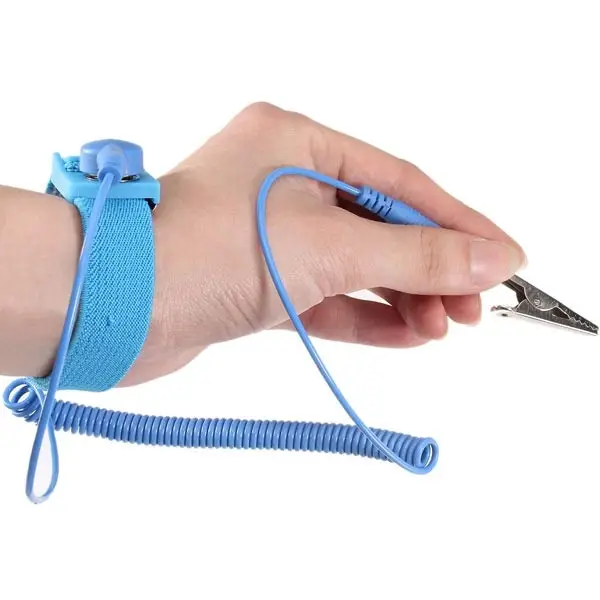
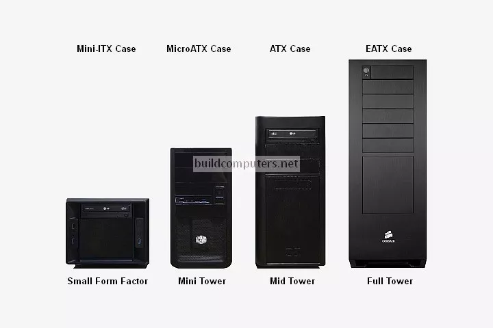
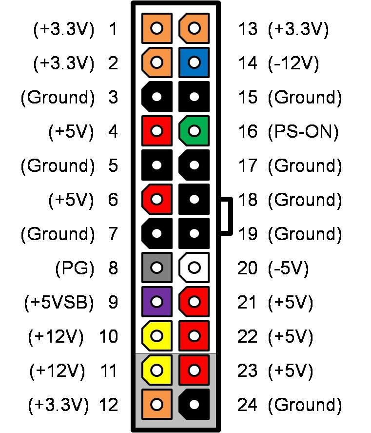
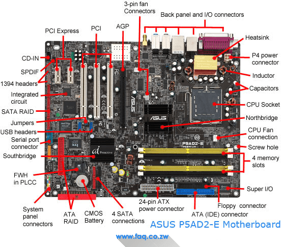

## 1. Правила електробезпеки при роботі з внутрішніми компонентами ПК

### Основні правила

* **Повністю знеструмити ПК** (вимкнути БЖ, вийняти кабель з розетки)
* **Заземлення**: використовувати антистатичний браслет або торкатись заземленого металу
* **Не працювати під напругою**
* **Не торкатись контактів і доріжок** плат
* **Уникати вологи та металевих предметів**
* **Працювати на нековзкій, сухій поверхні**

### Типові небезпеки

* Електростатичний розряд (ESD)
* Коротке замикання
* Пошкодження мікросхем

---

## 2. Форм-фактори корпусів настільних комп’ютерів

### Основні форм-фактори

| Форм-фактор        | Опис           | Переваги                | Недоліки           |
| ------------------ | -------------- | ----------------------- | ------------------ |
| **Full Tower**     | Великий корпус | Максимальне охолодження | Габаритний         |
| **Mid Tower**      | Стандартний    | Баланс розміру          | Обмежене місце     |
| **Mini Tower**     | Компактний     | Малий розмір            | Погане охолодження |
| **SFF / Mini-ITX** | Дуже малий     | Мобільність             | Обмежений апгрейд  |

### Сумісність

* Корпус ↔ форм-фактор материнської плати
* Корпус ↔ довжина відеокарти
* Корпус ↔ тип блоку живлення

---

## 3. Блок живлення (PSU)

### Основні характеристики

* **Потужність (Вт)** — 400–1000 W
* **ККД (80 PLUS)**: Bronze, Silver, Gold, Platinum
* **Форм-фактор**: ATX, SFX
* **Захисти**: OVP, UVP, SCP, OCP
* **Модульність**: немодульний / напів / повністю модульний

### Основні конектори

* **24-pin ATX** — материнська плата
* **4/8-pin CPU (EPS)** — процесор
* **PCIe 6/8-pin** — відеокарта
* **SATA** — SSD/HDD
* **Molex** — периферія

---

## 4. Основні компоненти материнської плати (7 шт.)

1. **Процесорний сокет** — встановлення CPU
2. **Чипсет** — керування шинами та портами
3. **Слоти оперативної пам’яті (DIMM)**
4. **Слоти розширення (PCIe)**
5. **Роз’єми живлення (24-pin, CPU)**
6. **BIOS / UEFI (мікросхема)**
7. **Порти введення/виведення (USB, LAN, Audio)**

