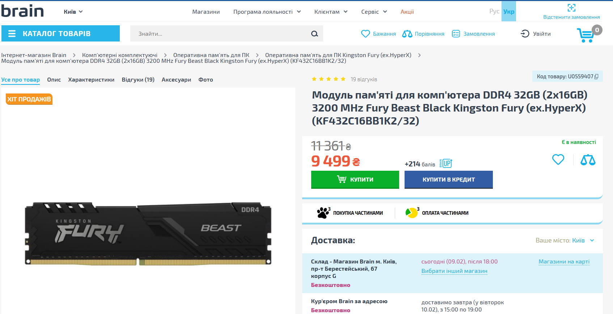
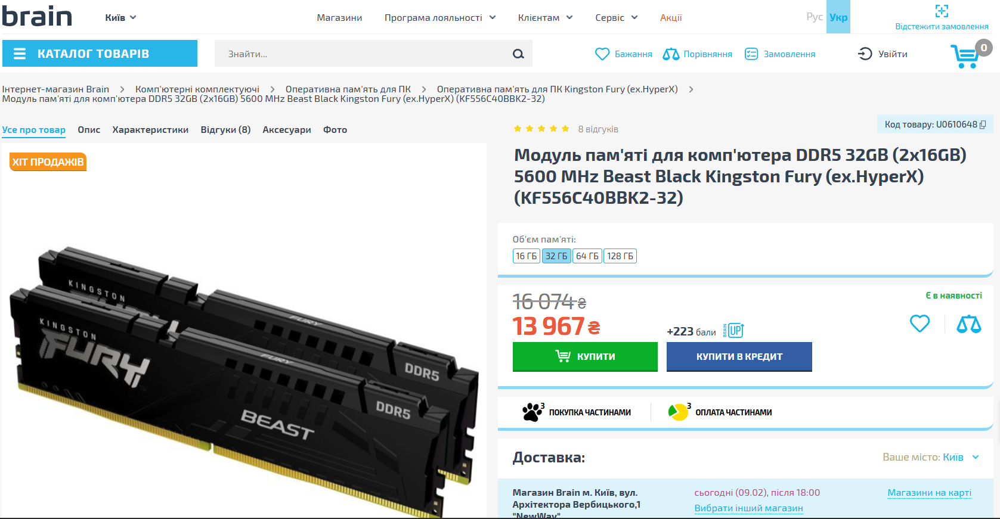

# **Характеристики оперативної пам'яті типів DDR4 та DDR5, їх порівняння**

---
## 1. Загальна характеристика DDR4

**DDR4 (Double Data Rate 4)** — стандарт оперативної пам’яті, що масово використовувався з ~2014 року.

**Основні параметри:**

- **Ефективна частота:** 2133–3200 МГц (типово), оверклокінг — до ~4000+ МГц
    
- **Напруга живлення:** 1,2 В (менше тепловиділення порівняно з DDR3)
    
- **Пропускна здатність:** до ~25,6 ГБ/с на канал (DDR4-3200)
    
- **Максимальний об’єм модуля:** до 64 ГБ
    
- **Кількість каналів:** 2 (Dual Channel)
    
- **ECC:** підтримується на серверних/робочих платформах
    
- **Затримки (latency):** відносно низькі (CL14–CL18 поширені)
    

**Переваги:**

- Висока стабільність і зрілість технології
    
- Низька вартість
    
- Широка сумісність з процесорами та материнськими платами
    

---

## 2. Загальна характеристика DDR5

**DDR5** — новіший стандарт пам’яті, орієнтований на високу пропускну здатність і масштабованість.

**Основні параметри:**

- **Ефективна частота:** від 4800 МГц і вище (6400–8400+ МГц у сучасних модулях)
    
- **Напруга живлення:** 1,1 В
    
- **Пропускна здатність:** від ~38,4 ГБ/с на модуль (DDR5-4800)
    
- **Максимальний об’єм модуля:** до 128 ГБ і більше
    
- **Архітектура каналів:** 2 незалежні 32-бітні підканали в одному модулі
    
- **ECC:** вбудована корекція помилок на рівні кристалу (on-die ECC)
    
- **Регулятор живлення (PMIC):** перенесений з материнської плати на модуль пам’яті
    

**Переваги:**

- Значно вища пропускна здатність
    
- Краща енергоефективність
    
- Підтримка великих об’ємів пам’яті
    
- Орієнтація на майбутні CPU та навантаження (AI, сервери, ігри)
    

---

## 3. Порівняльна таблиця DDR4 vs DDR5

|Характеристика|DDR4|DDR5|
|---|---|---|
|Рік впровадження|~2014|~2021|
|Частота (базова)|2133–3200 МГц|4800–6400+ МГц|
|Напруга|1,2 В|1,1 В|
|Пропускна здатність|до 25,6 ГБ/с|від 38,4 ГБ/с|
|Максимальний об’єм модуля|64 ГБ|128+ ГБ|
|Архітектура каналів|1 × 64-біт|2 × 32-біт|
|Затримки|Нижчі|Вищі (на старті)|
|PMIC|На материнській платі|На модулі|
|Сумісність|Старіші платформи|Нові CPU і плати|
|Ціна|Нижча|Вища|

---

## 4. Практичне порівняння

**DDR4 доцільно обирати, якщо:**

- Потрібна бюджетна або середньорівнева система
    
- Використовується старіший процесор
    
- Важливі низькі затримки та ціна
    

**DDR5 доцільно обирати, якщо:**

- Будується нова система “на майбутнє”
    
- Потрібна висока пропускна здатність (ігри, рендеринг, великі дані)
    
- Планується використання великих об’ємів ОЗП
    

---

## 5. Висновок

DDR5 — це **логічний еволюційний крок** після DDR4: вища швидкість, масштабованість і ефективність, але за вищу ціну та з більшими затримками на початкових поколіннях.  
DDR4 залишається **актуальним і вигідним** рішенням для багатьох задач.

# **Огляд пам'яті типів DDR4 та DDR5 вибраних з інтернет-магазину, їх порівняння**
---
## 1. Огляд DDR4

### Kingston FURY Beast DDR4 32GB (2×16GB) 3200 MHz

**Модель:** KF432C16BB1K2/32

Цей комплект оперативної пам’яті належить до добре перевіреного стандарту **DDR4** і орієнтований на сучасні, але вже зрілі платформи Intel та AMD. Пам’ять розрахована на ігрові системи та робочі ПК, що виконують ресурсоємні задачі: монтаж відео, 3D-рендеринг, багатозадачність.

**Ключові особливості:**

- Двоканальна конфігурація (2×16 ГБ)
    
- Робоча частота **3200 МГц**
    
- Низькі таймінги **CL16**, що позитивно впливає на затримки
    
- Підтримка **Intel XMP 2.0** та сумісність з **AMD Ryzen**
    
- Низькопрофільний чорний радіатор — зручний для компактних корпусів
    
- Повне заводське тестування та **довічна гарантія**
    

**Практичне застосування:**  
DDR4-3200 CL16 є «золотим стандартом» для DDR4-систем: оптимальне співвідношення ціни, стабільності та продуктивності. У більшості ігор і повсякденних задач ця пам’ять забезпечує дуже хорошу швидкодію.

---

## 2. Огляд DDR5

### Kingston FURY Beast DDR5 32GB (2×16GB) 5600 MHz

**Модель:** KF556C40BBK2-32

Цей комплект належить до нового стандарту **DDR5**, який орієнтований на платформи нового покоління. Пам’ять забезпечує значно вищу пропускну здатність і краще масштабування продуктивності в сучасних та перспективних задачах.

**Ключові особливості:**

- Двоканальний комплект 2×16 ГБ (логічно — через підканали DDR5)
    
- Висока частота **5600 МГц**
    
- Таймінги **CL40-40-40** (типові для DDR5 початкових і середніх частот)
    
- Знижена напруга живлення **1.25 В**
    
- Вбудовані сучасні механізми стабільності роботи DDR5
    
- Радіатор охолодження без підсвічування (стриманий дизайн)
    

**Практичне застосування:**  
DDR5 краще підходить для нових процесорів (Intel Core 12–14 поколінь, AMD Ryzen 7000), задач з інтенсивним обміном даними та систем «на майбутнє».

---

## 3. Порівняння характеристик

|Характеристика|DDR4 Kingston FURY Beast|DDR5 Kingston FURY Beast|
|---|---|---|
|Тип пам’яті|DDR4|DDR5|
|Об’єм|32 ГБ (2×16 ГБ)|32 ГБ (2×16 ГБ)|
|Частота|3200 МГц|5600 МГц|
|Стандарт|PC4-25600|PC5-44800|
|Таймінги|CL16|CL40-40-40|
|Напруга|1.35 В|1.25 В|
|Форм-фактор|288-pin DIMM|288-pin DIMM|
|ECC|Ні|Ні|
|Буферизація|Unbuffered|Unbuffered|
|Охолодження|Радіатор|Радіатор|

---

## 4. Порівняння в реальному використанні

**DDR4 (3200 МГц, CL16):**

- Менші затримки доступу до пам’яті
    
- Відмінна продуктивність у більшості ігор
    
- Краще співвідношення ціни та результату для вже наявних платформ
    

**DDR5 (5600 МГц, CL40):**

- Значно вища пропускна здатність
    
- Краще підходить для нових CPU та майбутніх програм
    
- Енергоефективніша та технологічно перспективніша
    

---

## 5. Висновок

- **Kingston FURY Beast DDR4 32GB 3200 МГц** — оптимальний вибір для систем на DDR4-платформах: стабільний, швидкий і економічно вигідний варіант.
    
- **Kingston FURY Beast DDR5 32GB 5600 МГц** — сучасне рішення для нових комп’ютерів, що забезпечує вищу пропускну здатність і запас продуктивності на майбутнє.
    
