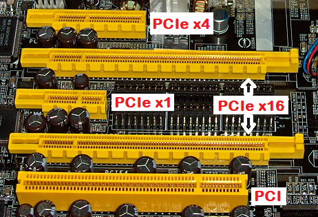
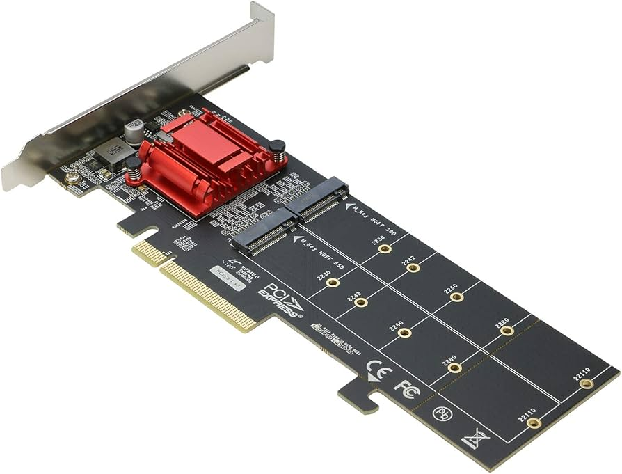
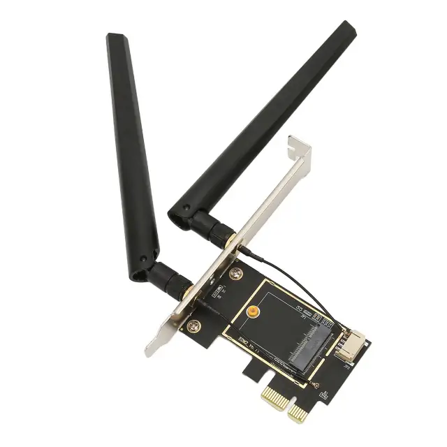

# Огляд та характеристики слотів розширення (Expansion Slots) на материнській платі

## 1. Загальна характеристика слотів розширення

Слоти розширення (Expansion Slots) — це апаратні інтерфейси на материнській платі, призначені для встановлення додаткових плат (карт розширення), які розширюють функціональні можливості комп’ютерної системи.

Вони забезпечують:

- Підключення графічних адаптерів
    
- Додавання мережевих інтерфейсів
    
- Підключення контролерів накопичувачів
    
- Розширення портів введення/виведення
    
- Спеціалізовані функції (захоплення відео, обчислення, серверні задачі)
    

Сучасні материнські плати використовують переважно інтерфейс PCI Express (PCIe).

---

## 2. Еволюція слотів розширення

### 2.1 ISA

Один із перших стандартів (1980-ті роки). Низька пропускна здатність, паралельна шина.

### 2.2 PCI (Peripheral Component Interconnect)

Паралельна 32-бітна або 64-бітна шина. Використовувалася у 1990–2000 роках.

### 2.3 AGP (Accelerated Graphics Port)

Спеціалізований слот для відеокарт, попередник PCIe.

### 2.4 PCI Express (PCIe)

Сучасний послідовний інтерфейс з високою пропускною здатністю та масштабованістю.

---

## 3. Інтерфейс PCI Express (PCIe)

### 3.1 Архітектура PCIe

PCI Express використовує послідовну передачу даних через лінії (lanes).  
Кожна лінія складається з двох пар сигналів: передача (TX) і прийом (RX).

Кількість ліній визначає пропускну здатність:

- PCIe x1 — 1 лінія
    
- PCIe x4 — 4 лінії
    
- PCIe x8 — 8 ліній
    
- PCIe x16 — 16 ліній
    

.webp)

---

### 3.2 Версії PCIe та пропускна здатність

|Версія|Швидкість на 1 lane|Пропускна здатність x16|
|---|---|---|
|PCIe 3.0|~1 GB/s|~16 GB/s|
|PCIe 4.0|~2 GB/s|~32 GB/s|
|PCIe 5.0|~4 GB/s|~64 GB/s|

Кожне покоління подвоює пропускну здатність.

---

### 3.3 Форм-фактори слотів PCIe

Фізично слоти можуть мати різну довжину:

- Короткий слот — x1
    
- Середній — x4
    
- Довгий — x16
    

Важливо: карта x1 може працювати у слоті x16 (за наявності підтримки).

---

## 4. Основні технічні характеристики слотів розширення

- Тип шини (PCIe 3.0 / 4.0 / 5.0)
    
- Кількість ліній (x1–x16)
    
- Максимальна пропускна здатність
    
- Підтримка живлення через слот
    
- Сумісність з поколіннями
    

Живлення:

- PCIe x16 забезпечує до 75 Вт
    
- Додаткове живлення подається через 6-pin / 8-pin конектори
    

---

# Карти розширення (Expansion Cards) на інтерфейсі PCIe

Нижче наведено 8 прикладів карт розширення для різних типів слотів PCIe.

---

## 1. Відеокарта (PCIe x16)

Призначення:

- Обробка 3D-графіки
    
- Відеорендеринг
    
- Обчислення (GPU computing)
    

Характеристики:

- Використовує слот x16
    
- Споживає значну кількість енергії
    
- Має власну систему охолодження
    

---

## 2. Мережева карта (PCIe x1 / x4)

Призначення:

- Підключення до Ethernet 1G/2.5G/10G
    
- Серверні рішення
    

---

## 3. Звукова карта (PCIe x1)

Призначення:

- Покращення якості звуку
    
- Професійна аудіообробка
    

---

## 4. RAID-контролер (PCIe x4 / x8)

Призначення:

- Створення RAID-масивів
    
- Підвищення надійності зберігання даних
    

---

## 5. NVMe-адаптер (PCIe x4)

Призначення:

- Підключення M.2 SSD через PCIe
    
- Максимальна швидкість зберігання
    

---

## 6. USB-контролер (PCIe x1)

Призначення:

- Додавання портів USB 3.0/3.2
    
- Розширення інтерфейсів введення/виведення
    

---

## 7. Wi-Fi / Bluetooth адаптер (PCIe x1)

Призначення:

- Бездротовий зв’язок
    
- Підтримка стандартів Wi-Fi 5/6/6E
    

---

## 8. Карта відеозахоплення (PCIe x4 / x8)

Призначення:

- Захоплення HDMI-сигналу
    
- Стрімінг та відеомонтаж
    

---

# Висновок

Слоти розширення PCI Express є ключовим елементом сучасної материнської плати. Вони забезпечують:

- Високу швидкість передачі даних
    
- Гнучкість конфігурації
    
- Можливість модернізації системи
    
- Підтримку сучасних високопродуктивних пристроїв
    

Карти розширення дозволяють адаптувати комп’ютер під конкретні задачі — від ігор до серверних обчислень і професійної роботи з мультимедіа.
